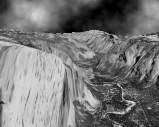
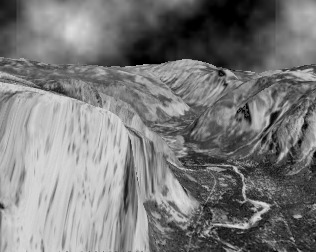
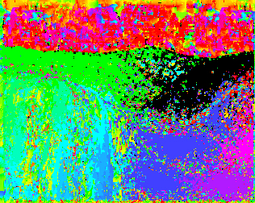
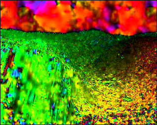

# OpticalFlow Implementations

A simple library with Implementations of various OpticalFlow methods using Classical Computer vision approaches.

## Dense Optical Flow Methods
* Block matching
* Horn & Shunck

### Depends on:
* stb_image headers
* Eigen3 Library

### sample outputs -There is a slight inward movement in the simulated images

| Frame1    | Frame2       |
| -------------- | -------------- |
 |   

#### Block Matching with windows size 7

#### Horn and Schunk - single iteration with alpha 100

